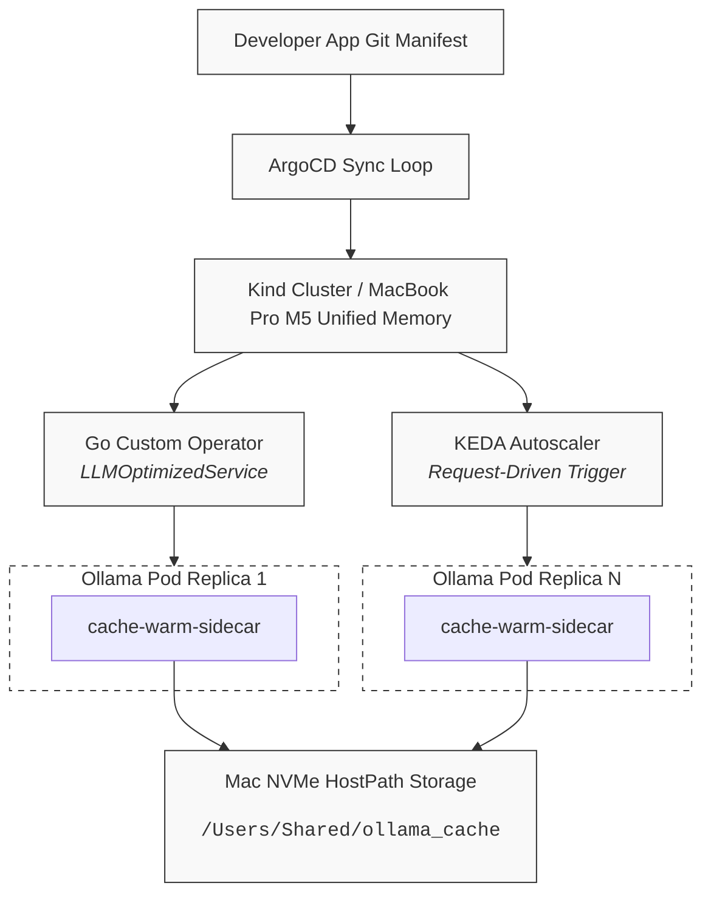

**AI-Native Platform Engine: Local LLM Inference Control Plane**

An enterprise-grade, GitOps-driven **Internal Developer Platform (IDP)** hosted entirely on local **MacBook Pro Apple Silicon (M5)** hardware using a Kubernetes orchestration layer (**Kind**).

This platform completely abstracts the complexities of AI infrastructure from application developers. By creating a custom Kubernetes controller in **Go**, application teams can provision optimized, auto-scaling, host-persisted **Ollama** inference engines using a simple declarative Custom Resource Definition (CRD) called LLMOptimizedService.

**Architecture Matrix**



**Core Engineering Features**

**Custom Go Operator Control Plane:** Extends the native Kubernetes API with an ai.mlo.platform/v1alpha1 controller using kubebuilder.

**Hardware-Aware Model Storage:** Uses a custom bridge layer to map cluster storage to a persistent local macOS directory (/Users/Shared/ollama_cache). This prevents multi-gigabyte models from being re-downloaded when pods cycle.

**Smart Model Warming:** Implements a container sidecar lifecycle pattern with restartPolicy: Always. The sidecar holds the container boot sequence until the inference API is awake, then automatically pre-warms the target model via loopback 127.0.0.1.

**Intelligent Request-Driven Autoscaling:** Replaces lagged system metric spikes (CPU/RAM) with reactive HTTP request-queue length profiling via KEDA and Prometheus.

**FinOps Observability Engine:** Features an integrated Grafana dashboard tracking operational metrics (TPS, queue depths) along with financial metrics, showing real-world value compared to commercial cloud APIs.


```
📁 Repository Structure
├── 📁 api/v1alpha1/
│   └── llmoptimizedservice_types.go    # Custom Resource Schema Specs
├── 📁 internal/controller/
│   └── llmoptimizedservice_controller.go# Reconciler logic (Deployment/Service/KEDA generation)
├── 📁 gitops-infra/
│   ├── 📁 system-operators/
│   │   └── operator-bundle.yaml        # Manifest for the containerized Go controller
│   └── 📁 apps/
│       ├── sample-llm.yaml             # Developer consumption manifest
│       ├── grafana-deployment.yaml     # Custom-mounted Prometheus-Grafana stack
│       └── dashboard-config.yaml       # ConfigMap containing the FinOps JSON dashboard
```


**Developer Interface (The Abstracted CRD)**

Application developers don't need to write complex Kubernetes manifests or configure network settings. They can easily deploy an isolated, auto-scaling LLM instance using the custom LLMOptimizedService CRD:

```yaml
apiVersion: ai.mlo.platform/v1alpha1
kind: LLMOptimizedService
metadata:
  name: secure-billing-llm
  namespace: default
spec:
  modelPath: "llama3"
  minReplicas: 1
  maxReplicas: 3
  maxConcurrencyPerPod: 2
```

**🚀 Installation & GitOps Workflow**

**1. Provision the M5 Kind Bridge Cluster**


```bash
# Prepare the physical host persistence target on macOS
mkdir -p /Users/Shared/ollama_cache

# Create the cluster configuration linking macOS and Docker namespaces
cat <<EOF > kind-config.yaml
kind: Cluster
apiVersion: kind.x-k8s.io/v1alpha4
nodes:
- role: control-plane
  extraMounts:
  - hostPath: /Users/Shared/ollama_cache
    containerPath: /mnt/ollama_cache
EOF

kind create cluster --name m5-platform --config kind-config.yaml
```

**2. Side-Load the Platform Operator**

```bash
# Build the binary container inside your local runtime env
make docker-build IMG=mlo.platform/local-llm-inference-control-plane:v1

# Inject directly into local Kind nodes without using external registries
kind load docker-image mlo.platform/local-llm-inference-control-plane:v1 --name m5-platform
```

**3. Deploy the GitOps Application Pipe**

```bash
# Initialize core system tools (ArgoCD & KEDA)
kubectl create namespace argocd
kubectl apply --server-side -n argocd -f https://raw.githubusercontent.com/argoproj/argo-cd/stable/manifests/install.yaml
kubectl apply --server-side -f https://github.com/kedacore/keda/releases/download/v2.20.0/keda-2.20.0.yaml

# Push the platform application mapping file to cluster namespace
kubectl apply -f gitops-infra/apps/argocd-app.yaml

```

**📊 Observability & FinOps Realization**

The monitoring layer uses a custom dashboard configuration mounted directly into a kube-prometheus Grafana instance. This allows you to visualize cluster operations and track financial savings:

```bash
kubectl create namespace monitoring
cd ~
git clone https://github.com/prometheus-operator/kube-prometheus.git
cd kube-prometheus
kubectl apply --server-side -f manifests/setup
# Delete unwanted components from the folder
# Remove Blackbox and Alertmanager configs
rm manifests/alertmanager-*
rm manifests/blackboxExporter-* 
#Deploy the remaining lightweight stackApply the remaining manifests, which will now only deploy the core engine, node tracking, and Kubernetes state tracking:
kubectl apply -f manifests/
cd -
```

```promql
# FinOps Value Chart: Tracks money saved in 24 hours vs cloud model pricing
(sum(increase(ollama_prompt_tokens_total[24h])) * 0.0000015) + (sum(increase(ollama_completion_tokens_total[24h])) * 0.000002)
```

**Dashboard Layout Preview**

**1. Live Scaling Tracking:**

Real-time graphs showing inbound request queues side-by-side with active pod replica counts created by KEDA.

**2. Unified Memory Velocity:**

Tracks tokens-per-second (TPS) to evaluate performance metrics across your Apple Silicon hardware.

**3. Accumulated Cloud Savings:**

A clear metric showing the real-world dollar amount saved by processing data locally.
